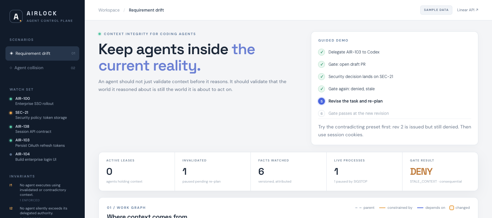
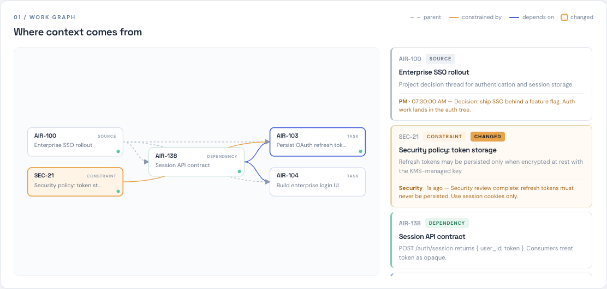
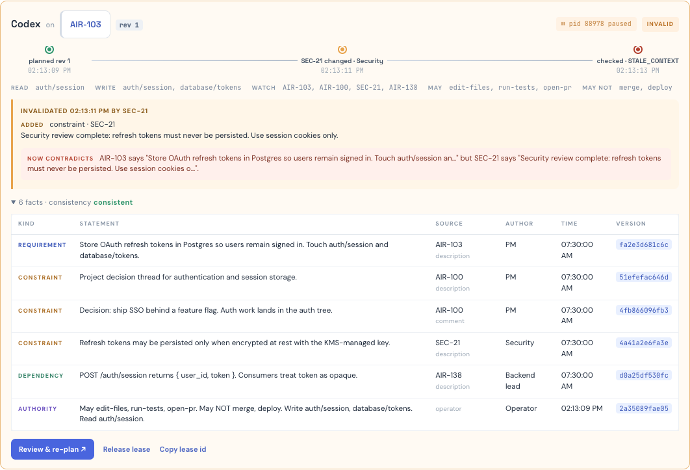

# Airlock

**Context integrity for coding agents working from Linear issues.**

[Live playground](https://sarvesh-tiku.github.io/Airlock-AI/) · [](https://github.com/sarvesh-tiku/airlock/actions/workflows/ci.yml) · Node 22, zero dependencies · Python and TypeScript clients

> An agent can be right when it starts and wrong when it acts. They should validate that the world they reasoned about is still the world they're about to act on.



## The failure mode

```
11:42  agent context validated              correct
11:43  agent plans the implementation
11:47  security changes the policy in Linear "never persist refresh tokens"
11:49  agent opens the PR                    wrong, and nothing caught it
```

The check at 11:42 was correct. The action at 11:49 was wrong. That is a time-of-check to time-of-use bug. Add a second agent touching the same files and it is a concurrency bug. Airlock treats it as both: versioned snapshots, invalidation on change, and a check immediately before the action rather than at the start.

## Context leases

Delegating an issue issues a **context lease**: a snapshot of the requirement, constraints, dependencies, and delegated authority. Every fact carries source issue, author, timestamp, and a version hash. The watch set comes from Linear's own graph: parent, related issues (constraints), blocking issues (dependencies).



Revalidation happens at three boundaries only: lease issue, any change to a watched source (webhook or sync), and right before a consequential action (`open-pr`, `merge`, `deploy`, `modify-schema`, `change-api-contract`, `close-issue`). A change to one source invalidates every lease watching it in the same pass. This is cache invalidation, not re-reading the world on every step.

A process running under the session guard is paused with `SIGSTOP` when its lease goes invalid and resumed with `SIGCONT` after a human revises the task and the new context passes review.

## The gate catching it

Security posts the decision. The lease flips to invalid with a diff of the fact that changed and what it now contradicts. The `pid … paused` pill is the real process, stopped.



The same action that passed a minute earlier is denied. The result carries planned-at and changed-at timestamps and names the invariant enforced.


Re-planning is refused until the ticket itself changes. A revision that still contradicts the policy ("keep refresh tokens, encrypt them") is issued as rev 2 and denied as `INCONSISTENT_CONTEXT`. A revision to session cookies is rev 3 and passes, and the process resumes. Every decision lands in an audit table keyed by lease revision and fact versions.

## Two agents, one contract

Agent A reads the session API contract to build the login UI. Agent B is delegated to change that contract. B is stopped: its write set intersects A's read set. Release A's lease and B proceeds. Optimistic concurrency control, applied to agents.


## Five checks, five invariants

No composite score. Five independent checks; the first failure decides.

| Check | Question | Invariant | Code |
|---|---|---|---|
| Freshness | Did a watched source change since the snapshot? | I1 · no agent acts on invalidated context | `STALE_CONTEXT` |
| Consistency | Does the requirement contradict an active constraint? | I1 | `INCONSISTENT_CONTEXT` |
| Provenance | Does every fact have source, author, time, version? | I5 · every action is traceable to what authorized it | `WEAK_PROVENANCE` |
| Authority | Are the action and path inside the delegated envelope? | I2 · no agent silently exceeds its authority | `OUT_OF_SCOPE` |
| Concurrency | Does another agent's write set intersect my read set? | I4 · conflicting writes cannot proceed unnoticed | `AGENT_COLLISION` |

I3, a human constraint propagates to every dependent active agent, is enforced on every change rather than at the gate.

Allow and deny are fully deterministic. Model review via the OpenAI Responses API (or OpenRouter through `OPENAI_BASE_URL`) can add a contradiction finding the heuristic missed and explain drift in one sentence. It cannot remove a denial, runs in the background, and is skipped for a minute after any failure so a dead key never slows the gate.

## Wrapping a real agent

```bash
# long-running agent: SIGSTOP on invalidation, SIGCONT after a clean re-plan
node bin/guarded-session.js LEASE_ID -- codex exec "implement AIR-103"

# one consequential command: runs only if the gate allows right now
node bin/guarded-action.js LEASE_ID open-pr auth/session -- gh pr create --draft
```

```python
from airlock import Airlock   # sdk/python, zero dependencies

airlock = Airlock()
lease = airlock.create_lease("ENG-142", agent="my-agent", write_set=["auth/**"])

@airlock.guarded(lease.id, "open-pr", ["auth/session"])
def open_pull_request(): ...  # raises ActionDenied instead of running
```

A typed TypeScript client with the same contract is in `sdk/typescript`. All wrappers fail closed when Airlock is unreachable.

## Running it

```bash
npm start     # http://127.0.0.1:3000, sample workspace, nothing to install
npm test      # `make test` also runs the Python and TypeScript suites
```

Real Linear: copy `.env.example` to `.env`, set `LINEAR_API_KEY`, run `npm run linear:seed` to create a demo issue graph in your workspace, import the task it prints. Consequential gate calls re-read Linear before deciding. Set `LINEAR_WEBHOOK_SECRET` and point a webhook at `/api/webhook/linear` for push-based invalidation; signatures are verified on the raw body.

The [playground](https://sarvesh-tiku.github.io/airlock/) runs the same engine file in the browser on sample data. No Linear, no process pausing, identical gate logic.

## Known limits

- The check-to-action window is closed only for tools routed through the gate. Linear and a Git host share no transaction.
- The session guard pauses a process. It cannot reach into a hosted agent runtime.
- The contradiction heuristic is negation plus shared terms, newest statement per source wins. It catches the obvious reversal and misses subtle ones.
- The control API is unauthenticated and bound to localhost.

---

Built from scratch on September 12, 2026 for the Agents, Everywhere hackathon (AI Tinkerers, with OpenAI). Decision logic: `src/engine.js`. Gate, webhook, UI: `src/server.js`. Wrappers: `bin/`. Clients: `sdk/`. Playground: `docs/`, generated from the same engine. All `AIR-*` and `SEC-*` issues are fictional. The test suite stops and resumes a real process.
